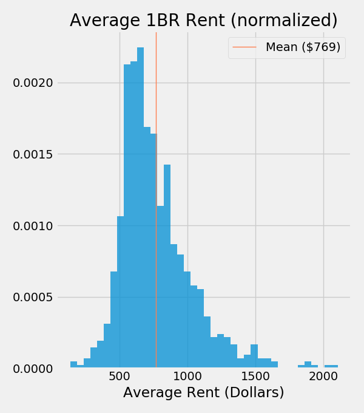
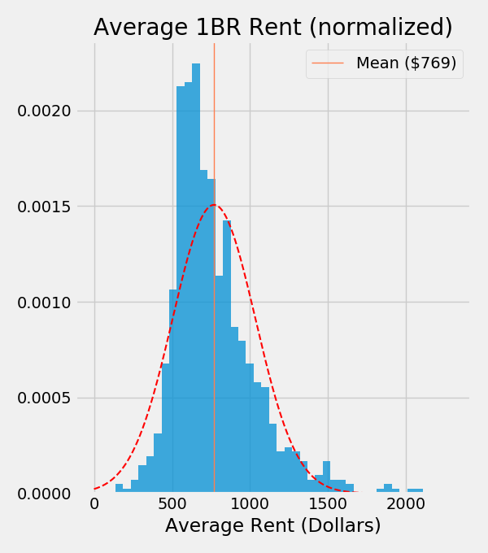
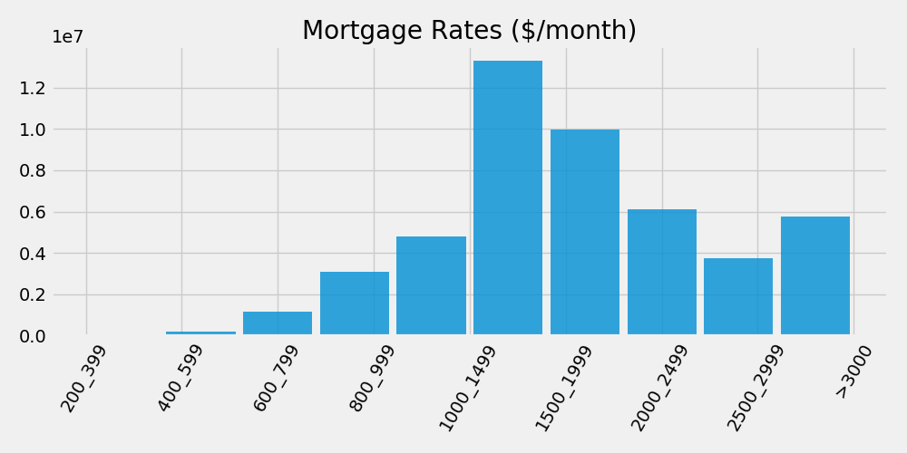

# Background
something something something dark side
## UBI: Universal Basic Income
gee that'd be swell

# Data

assumptions about normal distribution
## U.S. Census
### Rent
### Mortgage
## Bureau of Labor Statistics
### Expenses
only people making up to 69k/yr

# EDA
## The Cost of Housing

## Other "Core" Expenses

## The Full Picture
### How does it compare?
Colorado min wage

Fed Min Wage

COViD stimulus
## Policy Implications
rent control

# Sources