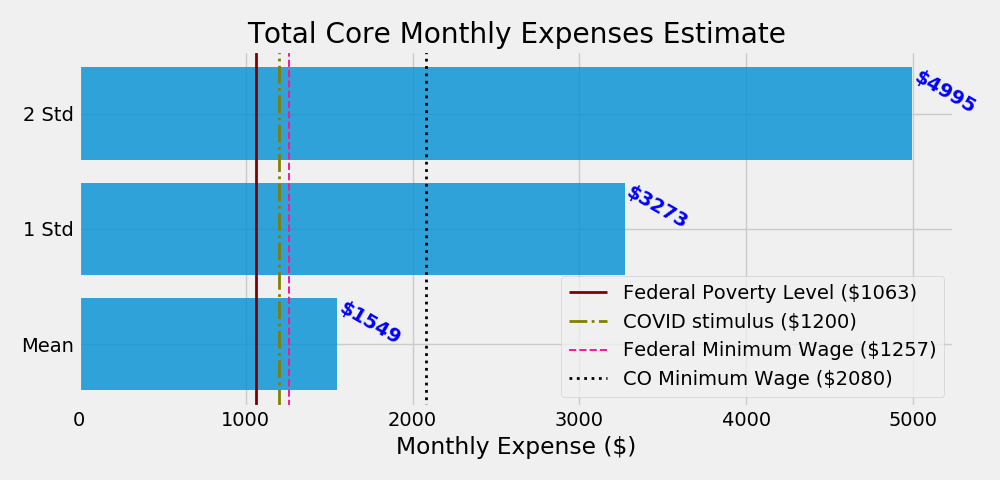

# Background
The newly minted COVID-19 stimulus bill has sparked conversation among both legislators and citizens as to how much money one needs to survive in today's world.  Whenever monthly cash payments come up in the national policy conversation, the discussion inevitably turns to Universal Basic Income (UBI).

## UBI: Universal Basic Income

 Source: cointelegraph.com

UBI is an idea that has its basis in the belief that food, shelter, healthcare, and other bare necessities are, in fact, human rights.  With no preconditions other than a human pulse, it would represent a departure from the current oversight-dependent welfare systems.  It is built upon the conviction that "the real experts on what poor people need are poor people themselves" (Bregman, 2018).
 
Randomized control trials across the globe have shown statistically significant correlation between unconditional cash transfers and reduced crime, teen pregnancy, and malnutrition, as well as improvements in areas like economic growth and school performance (Hanlon et al, 2014).  While organizations like GiveDirectly have successfully put this into practice across the global south, there has long been talk (both serious and not) of implementing similar strategies in more developed nations that retain high poverty levels.  It is often forgotten just how close the United States came to making this a reality as early as 1969.  Yes, that's right, Richard Nixon. 
 
Such a bill had already passed the House of Representatives, and Nixon would have been days away from guaranteeing every American family of four $1600 per year, *nearly $11,000 in 2020 dollars*.  On the day he intended to take the plan public, he was presented with the disastrous [Royal Commission Report](https://en.wikipedia.org/wiki/Royal_Commission_into_the_Operation_of_the_Poor_Laws_1832) on a late 1700s welfare program from Speenhamland, England.  The report was later revealed to be written almost entirely without the collection of data, and only to reinforce existing beliefs about the correlation between poverty and moral impurity (Bregman, 2018).  Unfortunately, the damage was already done.  The bill, along with the President's chance at making history, never fully recovered.

Check out: [UBICalculator](https://ubicalculator.com/)

# Data
Thanks to the good work of the people at the Census Bureau and the Bureau of Labor Statistics, much of my data came in a pre-aggregated form (many of my base data points were already averages).  While this makes comprehension easier, it also became a limitation on what sort of statistical analysis I was able to perform with the data.  In order to conduct an analysis, I had to make assumptions regarding the distributions of expenses, namely, that they were normally distributed.  

additional assumptions:

1. Regarding what expenses could be considered 'core' for the purposes of this exercise, I chose housing, food, healthcare, and transportation.

2. I chose to focus on single individuals under the assumption that they would be the least likely to have support for their income from other individuals.

3. I selected rent for 1 Bedroom housing under the assumption that this would be enough for the aforementioned single person.

In summary: An appropriate UBI ought to be able to fully cover the cost of **basic** necessities for a **single** person living in a **single** bedroom who, for any reason, cannot provide **any** additional income for themselves.
   
### Pipeline
I used Pandas DataFrames to turn the raw .csv data into workable tables.  My data pipeline included stripping null rows, replacing null values with column means, replacing stray ASCII characters among the numbers, transposing and reindexing several tables, changing data types, and reducing down to only essential information.

## U.S. Census
### Rent

This data was available down to the county level on the census website.  In addition to the reasons stated above for using 1 Bedroom rent, the data provided had much larger margins of error for 3, 4, and 5 bedroom accomodations, likely due to smaller samples with higher variance.

**Bonus:** Below is a table showing the 20 most expensive counties in the U.S. for 1 bedroom rent.  An appropriate follow-up to the work I have done in this project might be to apply local housing cost as a sliding variable to a UBI estimation.  That is: to determine outliers in the housing cost category and adjust UBI accordingly for those individuals.

### Mortgage
This data provided the biggest cleaning challenge as it was provided with non-descriptive column-names, and all categories and sub-categories were expressed laterally in a single row.  After careful consideration of the story it was telling (and fully cleaning the data) I decided to exclude this table from my final analysis, as outright home-ownership does not necessarily fall within the core parameters I have set for UBI.

## Bureau of Labor Statistics
The BLS data reports the average annual expenses of single men and women. Just over 50% of individuals from this dataset came from income brackets below $30,000/yr, higher than the national estimate of roughly 30%.  This likely has the effect of lowering average costs when compared with the population.  An additional factor to this effect was the asymmetry of certain income categories between the two datasets.  For this reason I only considered data for income brackets up to $70,000/yr.

# EDA
## The Cost of Housing

It is unknown if this includes individuals who are simply renting a bedroom in a house, as opposed to a full, "1 Bedroom" house or apartment.

## Other Core Expenses
These charts are most informative from the mean rightward.  In interpreting this data, I have made the assumption that the mode is likely quite close to the minimum in these cases.  Considering that our sample population is heavily weighted towards the lower end of the wealth scale, it would be unsurprising for the highest number of values to occur around the lowest possible price in a given category.  If we recall the mean rent plot, we find that its distribution fits well with the above assumption, with a sharp incline relatively close to the mode, and a more normal decline as prices go up.

The following three plots were calculated using weighted averages calculated from the expenses table shown above to create an approximate distribution for each expense type.

### Food

### Healthcare
Note: This data almost certainly includes uninsured individuals and individuals covered by their employer whose real health costs are hidden.

### Transportation

Note: the relatively large standard deviation in this plot.

# The Full Picture
### How does it compare?

Keeping in mind that it is important to be inclusive, rather than exclusive in this analysis, this plot includes estimates for the mean up to 2 standard deviations above the mean.

We find that our lowest threshold for core living expenses far exceeds the federal poverty level, the federal minimum wage, and the proposed COVID stimulus check amount.  Perhaps a sign that these metrics are in need of an update.

The Colorado minimum wage would theoretically do the job here, with nearly $400/mo available for saving or additional expenditures.  Keeping in mind, of course, that almost everyone has expenses beyond the core.

It is safe to say that *if* UBI were to make its way back onto the legislative table or, more prescient, **if a follow-up COVID relief bill were to provide monthly payments to Americans**, the *absolute floor* for such a monthly provision should be $1550.  

I contend that this figure would help a great many people keep their homes and their lives, but it would also leave out substantial swaths of our population.  Here I believe that the accounting done by the State of Colorado and five other states is sound.  **A monthly payment of roughly $2,100/mo ($12/hr equivalent) would be required** to keep as many people fed, in their homes, and away from collections as possible.

**Annual and hourly breakdowns for the above benchmarks:**

Colorado min wage: $12/hr - $2,080/mo - $24,960/yr

Fed Min Wage: 7.25/hr - $1,257/mo - $15,080/yr

COViD stimulus: $1200/mo - $14,400/yr

Fed poverty level, single person: $1,063/mo - $12,760/yr

# Lessons Learned

- For statistical analysis, the more "raw" the data is, the better.
- It's okay to let the EDA ask some of its own questions.

# Sources

Bregman, R. (2018). Utopia for realists: how we can build the ideal world. New York: Back Bay Books.

Hanlon, J., Hulme, D., & Barrientos, A. (2014). Just Give Money to the Poor The Development Revolution from the Global South. Sterling: Kumarian Press.