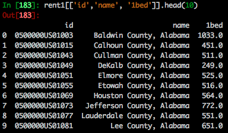
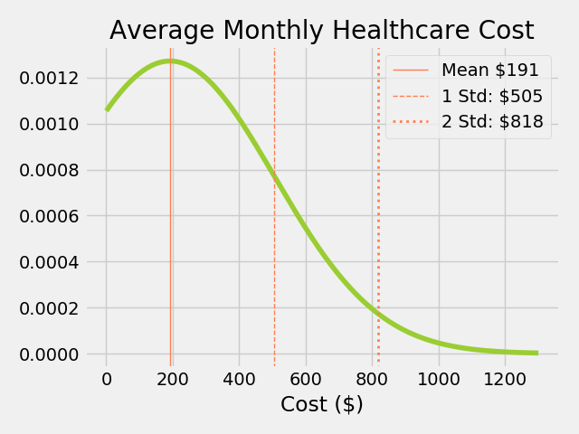
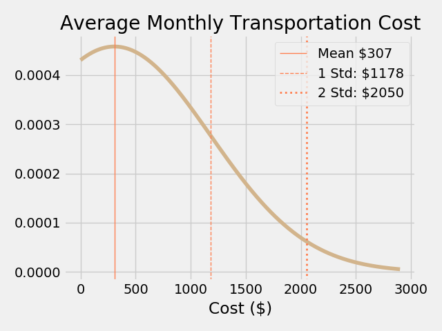

# Background
The newly minted COVID-19 stimulus bill has sparked conversation among both legislators and citizens as to how much money one needs to survive in today's world.  Whenever monthly cash payments come up in the national policy conversation, the discussion inevitably turns to Universal Basic Income (UBI).

## UBI: Universal Basic Income

UBI is a an idea that has its basis in the belief that food, shelter, healthcare, and other bare necessities are, in fact, human rights.  With no preconditions other than a human pulse, it would represent a departure from the current oversight-dependent welfare systems.  It is built upon the conviction that "the real experts on what poor people need are poor people themselves" (Bregman, 2018).

Randomized control trials across the globe have shown statistically significant correlation between unconditional cash tranfers and reduced crime, teen pregnancy, and malnutrition, as well as improvements in in areas like economic growth and school performance (Hanlon et al, 2014).  While organizations like GiveDirectly have successfully put this into practice across the global south, there has long been talk (both serious and not) of implementing similar strategies in more developed nations that retain high poverty levels.  It is often forgotten just how close the United States came to making this a reality as early as 1969.  Yes, thats right, Richard Nixon.  

Such a bill had already passed the House of Representatives, and Nixon would have been days away from guaranteeing every American family of four $1600 per year, *nearly $11,000 in 2020 dollars*.  On the day he intended to take the plan public, he was presented with a Royal Commission Report on a late 1700s welfare program from Speenhamland, England.  The report was later revealed to be written almost entirely without the collection of data, and only to reinforce existing beliefs about the correlation between poverty and moral impurity (Bregman, 2018).  Unfortunately, the damage was already done.  The bill, along with the President's chance at making history, never fully recovered.

Check out: [UBICalculator](https://ubicalculator.com/)

# Data
Thanks to the good work of the people at the Census Bureau and the Bureau of Labor Statistics, much of my data came in a pre-aggregated form (many of my base data points were already averages).  While this makes comprehension easier, it also became a limitation on what sort of statistical analysis I was able to perform with the data.  In order to conduct an analysis, I made assumptions regarding the distributions of expenses, namely, that they were normally distributed.  

additional assumptions:

1. Regarding what expenses could be considered 'core' for the purposes of this exercise, I chose housing, food, healthcare, and transportation.

2. I chose to focus on single individuals under the assumption that they would be the least likely to have support for their income from other individuals.

3. I selected rent for 1 Bedroom housing under the assumption that this ought to be enough for the aforementioned single person.

In summary: An appropriate UBI ought to be able to fully cover the cost of **basic** necessities for a **single** person living in a **single** bedroom who, for any reason, cannot provide **any** additional income for themselves.
   

## U.S. Census
### Rent

### Mortgage
This data provided the biggest cleaning challenge as it was provided with non-descriptive column-names, and all columns and sub-columns were expressed laterally in a single row.  After careful consideration (and fully cleaning the data) I decided to exclude this table from my final analysis, as outright home-ownership does not necessarily fall within the core parameters I have set for UBI.

## Bureau of Labor Statistics
The BLS data reports the average annual expenses of single men and women. Just over 50% of individuals from this dataset came from income brackets below $30,000/yr, higher than the national estimate of roughly 30%.  This, combined with the fact that the selected demgraphic is likely to be the sole earner, likely has the effect of lowering average costs when compared with the population.  An additional factor to this effect was the exlusion of certain income categories on for the female data.  For this reason I only considered data for income brackets up to $70,000/yr.

# EDA
## The Cost of Housing

interesting to no that the most filled bucket is  1-1.5k.  I expect this difference can be partially explained by the definition of "1 Bedroom" in our rent catagory.  I suspect that this includes folks who are simply renting a badroom in a house, as opposed to a full, "1 Bedroom" house or apartment.

## Other Core Expenses
These charts are most informative from the mean rightward.  In interpreting this data, I have made the assumption that the mode is likely quite close to the minimum in this these cases.  Considering that our sample population is heavily weighted towards the lower end of the wealth scale, it is unsurprising that the most values occur around the 'best deal' in a given category.  If we recall the mean rent plot, we find that its distribution fits well with the above assumption, with a sharp incline relatively close to the mode, and a more normal decline as prices go up.

### Food

### Healthcare

uninsured and employer covered

### Transportation

# The Full Picture
### How does it compare?

Keeping in mind that it is important to be inclusive, rather than exclusive in this analysis, the estimates included are for the mean up to 2 standard deviations above the mean.

Colorado min wage - 12/hr - 24,960/yr

Fed Min Wage - 7.25/hr - 15,080/yr

COViD stimulus - $1200/mo - 14,400/yr

Fed poverty levels - single person, $12,760/yr

# Lessons Learned

- For statistical analysis, the more "raw" the data is, the better.

# Sources

Bregman, R. (2018). Utopia for realists: how we can build the ideal world. New York: Back Bay Books.

Hanlon, J., Hulme, D., & Barrientos, A. (2014). Just Give Money to the Poor The Development Revolution from the Global South. Sterling: Kumarian Press.